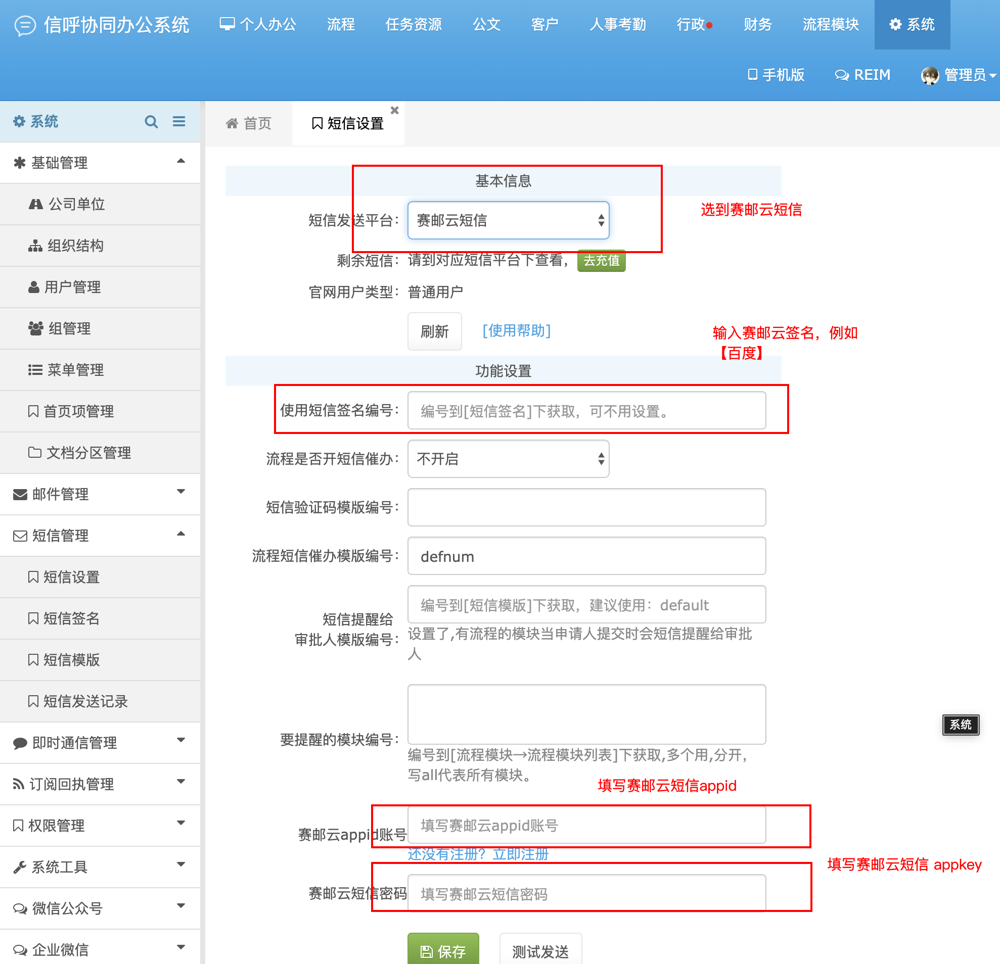

## OVERVIEW

### 信呼OA Plug-Ins Overview

------
	信呼OA 短信插件
How to use

使用方法
    把下载好的信呼OA 赛邮云短信插件程序解压覆盖到网站根目录
  浏览器地址栏输入：

    http://域名/submail_install.php
   成功后请将Xinhu根目录下的submail_install.php文件删除

    （如果提示no access 请找到\webmain\webmainConfig.php 删除第一行代码 if(!defined('HOST'))die('not access'); ）

			短信验证码模版编号：defyzm
			流程短信催办模版编号：defnum
			短信提醒给：审批人模版编号：default

	Linux环境请设置插件文件的读写权限（777）
