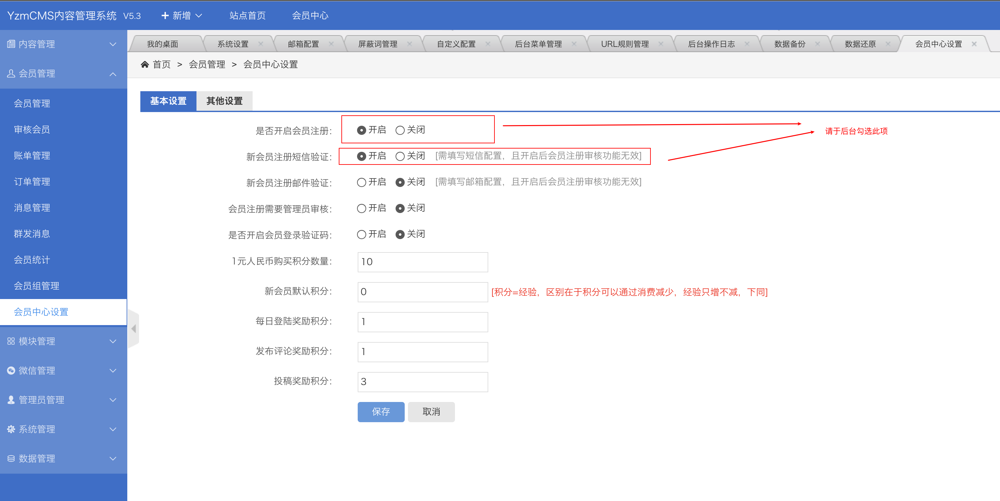
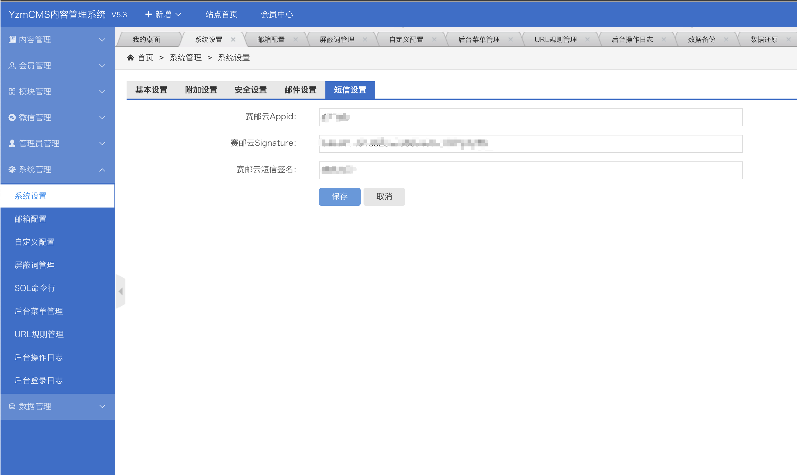

## OVERVIEW

### YZMCMS短信 Plug-Ins Overview

------
	YZMCMS短信 短信插件
How to use

		插件内部分文件除submail.sql,submail.php,reset_mobile.html外，均为为对系统原文件的修改，如果你的系统经过二次开发，请先核对插件文件代码，否则请直接将插件内的文件覆盖原文件。

		浏览器地址栏输入：http://域名/submail.php,出现以下提示，说明短信插件安装成功。成功后请将YzmCMS根目录下的submail.php和submail.sql文件删除。

